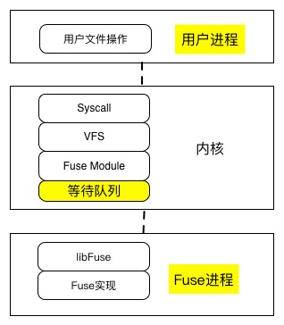

##用Go和Fuse实现一个文件系统.md

##目标
1，用高级语言实现简单的文件系统；

2，查看fuse对Buffered IO和Direct IO的支持；

3, 了解fuse安全和并发竞争；

##fuse原理

Fuse通过Fuse服务进程调用文件系统的具体实现。用户进程和Fuse服务进程都通过syscall进入内核，然后在内核wait\_queue上实现同步。
Fuse Protocal是在/dev/fuse文件上通过read、write实现的通信协议，用于Fuse服务进程跟Fuse内核模块通信。

开发fuse文件系统时，用户只需要关心实现Fuse接口，就像是按照框架开发一个应用程序。

下面是fuse.txt里描述的一个具体例子

**fuse使用基础：**

1，挂载一个fuse文件系统 == 执行你实现的fuse程序

例如：

$ ./src/bbfs example/rootdir/ example/mountdir/

$ df -h example/mountdir/

Filesystem      Size  Used Avail Use% Mounted on
bbfs            991M  553M  387M  59% /home/andy/fuse-tutorial-2016-03-25/example/mountdir

2，卸载 umount

也可以使用 fusermount -u mountdir

例如：

$ fusermount -u example/mountdir/

$ $ df -h example/mountdir/

Filesystem      Size  Used Avail Use% Mounted on
/dev/sdb1       991M  553M  387M  59% /

3，编译需要fuse库

后面，这里链接go-fuse

4，fuse使用socket和callback

用户代码 -> socket -> 内核代码 -> callback -> 用户代码

libfuse提供了使用socket和callback的接口，callback接口即需要用户实现fuse\_operations.

fuse\_operations核心参数包括：fuse\_file\_info, 

5，fuse\_main传入实现的接口和自定义私有结构

fuse\_context -> private\_data  void \*

例如：

fuse\_stat = fuse\_main(argc, argv, &bb_oper, bb_data)

**bazil.org go-fuse使用基础:**

在Go-fuse中，文件系统操作函数分为Node接口和Handle接口，这些接口对应fuse里的 fuse\_operations。Dir，file对象都需要实现Node和Handle接口。
通过mount()建立跟服务进程Server的Conn。FS接口表达文件系统元数据操作接口，fs对象实现FS接口。Go-fuse的Server(conn，fs)对应fuse的fuse\_main()函数。Server将来自Kern的请求req通过Conn发送给fs的具体Dir或File对象，由具体的实现方法通过Conn返回resp。Server再将Resp发个Kern。

1，fs.Serve 用于跟kerel进行FUSE protocol通信

2，go-fuse方法需要实现下面3种interface:
	
	FS* (file system)
	
	Node* (file / Dir)
	
	Handle* (opened file / opened Dir)
	
Go-fuse的Node和Handle接口对应了fuse的fuse_operations中的函数。Node接口对应元数据操作，Handle对应文件操作。

具体Dir，File，Symlink类型等需要实现Node和Hanle这2种接口。

go-fuse方法具有下面的通用形式：

	OP(ctx context.Context, req \*OpRequest, resp \*OpResponse) error

3，多个goroutines会同时调用go-fuse方法，由go-fuse方法的具体实现负责同步

4，go-fuse给文件系统的client返回errno

go-fuse方法返回的error需实现ErrorNumber，否则默认错误是EIO。

go-fuse错误消息也记录到debug log中。

	fuse.EINTR表示操作abort
	
5，权限

go-fuse的全部request types都嵌入了Header，方法可以使用req.Pid, req.Uid, req.Gid检查权限。

6，mount选项 MountOption

通过将MountOption传递给Mount，可以改变已经挂载的文件系统的行为和元数据。  

**bazil go-fuse关键对象和方法：**

1, Mount函数

	func Mount(dir string, options ...MountOption) (*Conn, error)
在指定的挂载目录dir建立一个FUSE连接Conn，Conn用于读写FUSE消息，Conn.MountError记录错误消息。

成功返回后，caller必须使用Close释放资源；新挂载直到Conn.Ready关闭后，才能可见。

MountOption:
	
	type MountOption mountOption
	type mountOption func(*mountConfig) error
	type mountConfig struct {
		options				map[string]string
		maxReadahead		uint32
		initFlags			InitFlags
		osxfuseLocations	[]OSXFUSEPaths
	}
	
	func (m *mountConfig) getOptions() string
	
MountOption函数：

	// 设置文件系统挂载名称
	func FSName(name string) MountOption
	
	// 设置挂载的文件系统类型。主类型总是fuse，子类型例如ext2、ntfs
	// Mac, freeBSD忽略这个值
	func SubType(fstype string) MountOption
	
	// 强制内核按照file mode设置访问权限。
	// 可以不使用。fuse默认不允许其他用户访问。
	func DefaultPermissions() MountOption
	
	func ReadOnly() MountOption
	
	// 顺序读使的最大预读 字节数
	func MaxReadahead(n uint32) MountOption
	
	// 允许一个handle上有多个并发读请求
	// 否则，一个handle最多只能有一个读请求
	func AsyncRead() MountOption
	
	// 使用内核buffer write，然后再发给Fuse Server
	// 否则，使用write through
	func WritebackCache() MountOption
	
	// 允许在非空Dir上挂载
	func AllowNonEmptyMount() MountOption
	
	// 访问权限。注意安全
	func AllowOther() MountOption
	func AllowRoot() MountOption
	
	// 允许在这个文件系统中 创建字符和块设备文件
	func AllowDev() MountOption
	
	// 允许设置user id和group id
	func AllowSUID() MountOption
	
	// 下面几个仅Mac使用，其他OS忽略
	func LocalVolume() MountOption
	func VolumeName(name String) MountOption
	func NoAppleDouble() MountOption
	func NoAppleXattr() MountOption
	func ExclCreate() MountOption
	func DaemonTimeout(name string) MountOption
	func OSXFUSELocations(paths ...OSXFUSEPaths) MountOption

2，Conn：表示在挂载Fuse fs上的连接

公共属性：

	type Conn struct {
		// Ready chan 在挂载成功或失败后关闭
		Ready <-chan struct {}
		
		MountError error
		
	}

公共方法：

	func (c *Conn) Close() error
	
	func (c *Conn) fd() int
	
	func (c *Conn) Protocol() Protocol
	
	// ReadRequest从内核读取消息，负责构造并返回Fuse Request。
	// Caller必须尽快调用Request.Respond或者Request.RespondError,
	// 之后Caller不能再持有这个Request。
	func (c *Conn) ReadRequest() (Request, error)
	
	// 使一个inode的内核cache无效，包括attributes和数据。
	// offset 0, size -1 所有数据
	// offset 0, size 0 仅atrributes
	// 如果cache没有命中，返回ErrNotCached
	func (c *Conn) InvalidateNode(nodeID NodeID, off int64, size int64) error
	
	// 使一个dentry的内核cache无效。
	// 传入父目录inode和这个dentry的name
	// 如果cache没有命中，返回ErrNotCached
	func (c *Conn) InvalidateEntry(parent NodeID, name string） error
	
3， Seveve函数：服务一个Fuse连接Conn
	
	func Serve(c *fuse.Conn, fs FS) error
	
4，接口

FS 操作fs元数据:

	type FS interface {
		// 获得文件系统根目录的inode
		Root() (Node, error)
	}
	
	type FSStatfser interface {
		// 获得文件系统元数据
		Statfs(ctx context.Context, req *fuse.StatfsRequest,
			resp *fuse.StatfsResponse) error	
	}

	type FSDestroyer interface {
		// 关闭文件系统
		// Linux用来在umount前，对块设备发起flush
		Destroy()
	}
	
	type FSInodeGenerator interface {
		// 获得一个ino (go-fuse 将ino称为inode，而inode称为Node)
		GenerateInode(parentInode uint64, name string) uint64
	}

Node 操作inode元数据:

	type Node interface {
		// 按inode元数据获得Attr
		Attr(ctx context.Context, attr *fuse.Attr) error
	}
	
	// Attr和Getatter只需要实现一个
	type NodeGetattrer interface {
		// 为reciever获得inode元数据，返回resp
		Getattr(ctx context.Context, req *fuse.GetattrRequest,
			resp *fuse.GetattrResponse) error
	}
	 
	type NodeSetatter interface {
		// 为reciver设置inode元数据，返回resp
		Setattr(ctx context.Context, req *fuse.SetattrRequest,
			resp *fuse.SetattrResponse) error
	}
	
	type NodeSymlinker interface {
		// 在receiver里创建一个符号链接。receiver必须是dir
		Symlink(ctx context.Conext, req *fuse.SymlinkRequest) (Node, error)
	}
	
	type NodeReadLinker interface {
		// 读取一个符号链接
		Readlink(ctx context.Context, req *fuse.ReadlinkRequest) (string, error)
	}
	
	type NodeLinker interface {
		// 在receiver里，创建硬连接
		Link(ctx context.Context, req *fuse.LinkRequest, oldNode) (Node, error)
	}

	type NodeRemover interface {
		// 在receiver里，按名字删除inode。（unlink或者rmdir）
		Remove(ctx context.Context, req *fuse.RemoveRequest) error
	}

	type NodeAccesser interface {
		// 检查ctx是否具有访问receiver的权限
		Access(ctx context.Context, req *fuse.AccessRequest) error
	}
	
	type NodeStringLookuper interface {
		// 在receiver里，按name查找inode。返回inode，或者ENOENT
		// 不处理"."和".."
		Lookup(ctx context.Context, name string) (Node, error)
	}
	
	type NodeMkdir interface {
		Mkdir(ctx context.Context, req *fuse.MkdirRequest) (Node, error)
	}
	
	type NodeOpener interface {
		// 打开receiver. 成功后进程的file描述符指向Handle。
		// 如果Open没有实现，那么Open返回成功且inode用作Handle。
		Open(ctx context.Context, req *fuse.OpenRequest,
			resp *fuse.OpenResponse) (Handle, error)
	}
	
	type NodeCreater interface {
		Create(ctx context.Context, req *fuse.CreateRequest,
			resp *fuse.CreateResponse) (Node, Handle, error)
	}
	
	type NodeForgetter interface {
		// Forget一个inode。这个inode后续不会收到方法调用。
		Forget()
	}

	type NodeRenamer interface {
		Rename(ctx context.Context, req *fuse.RenameRequest, newDir Node) error
	}
	
	type NodeMknoder interface {
		Mknod(ctx context.Context, req *fuse.MknodRequest) (Node, error)
	}
	
	type NodeFsyncer interface {
		Fsync(ctx context.Context, req *fuse.FsyncRequest) error
	}
	
	// extended attributes
	type NodeGetxatter interface {
		Getxattr(ctx context.Context, req *fuse.GetxattrRequest,
			resp *fuse.GetxattrResponse) error
	}
	
	type NodeListxatter interface {
		Listxattr(ctx context.Context, req *fuse.ListxattrRequest,
			resp *fuse.ListxattrResponse) error
	}
	
	type NodeSetxatter interface {
		Setxattr(ctx context.Context, req *fuse.SetxattrRequest) error
	}
	
	type NodeRemovexattrer interface {
		Removexattr(ctx context.Context, req *fuse.RemovexattrReuest) error
	}
	
Handle 操作文件数据:

	// Handle是打开文件的接口
	type Handle interface {
	}
	
	type HandleFluser interface {
		// 每次关闭文件时调用Flush。刷page cache
		Flush(ctx context.Context, req *fuse.FlushRequest) error
	}
	
	// 实现Read后，不需要实现ReadAll。ReadAll不适合读取大文件，buf内存
	type HandleReadAller interface {
		ReadAll(ctx context.Context) ([]byte, error)
	}
	
	type HandleReadDirAller interface {
		ReadDirAll(ctx context.Context) ([]fuse.Dirent, error)
	}
	
	type HandleReader interface {
		Read(ctx context.Context, req *fuse.ReadRequest,
			resp *fuse.ReadResponse) error
	}
	
	type HandleWriter inteface {
		// resp.size存放写入数据量
		Write(ctx context.Context, req *fuse.WriteRequest,
			resp *fuse.WriteResponse) error
	}
	
	type HandleRelease interface {
		// 关闭文件
		Release(ctx context.Context, req *fuse.ReleaseRequest) error
	}

##实现

代码：
	

要点：

	1，root的inode必须是1

	2，想好路径名规则

##问题

bazil go-fuse的fd/File存在Bug，经常遇到“bad file descriptor”错误，读写大文件几乎100%遇到。

在linux下的goroutine数量过多，大量goroutine没有正常终止

##安全
访问fuse文件系统的进程 具有挂载者的权限，而不是访问这个fuse文件系统的进程本身的权限。

**情况1：挂载fuse的用户 没有设置allow_other**

只有挂载fuse文件系统的用户可以访问这个fuse文件系统。此时，没有安全风险。

**情况2：挂载fuse的用户 设置allow_other**

任何访问这个fuse文件系统的进程都具有挂载者的权限。

fuse.h规定了几个检查接口，比如chown，程序员负责这些接口。

其中，fuse\_get\_context()返回fuse\_context，包含了进程的uid和gid。

**情况3：挂载fuse的用户是root**

任何访问这个fuse文件系统的进程都具有root权限！！

必须禁止。

##并发访问和竞争

1，fuse默认多线程，因此存在并发修改共享数据的可能。

2，fuse可能将一个接口调用翻译为多个接口调用。不确定fuse是否实现了接口的原子性，很大可能是没有实现原子性。

3，fuse代码本身确保不会锁住它自己的代码和数据。因此，主要关注用户代码的锁和竞争。

##引用
【1】https://www.cs.nmsu.edu/~pfeiffer/fuse-tutorial/html/index.html

【2】https://www.kernel.org/doc/Documentation/filesystems/fuse.txt

 